<p align="center">
  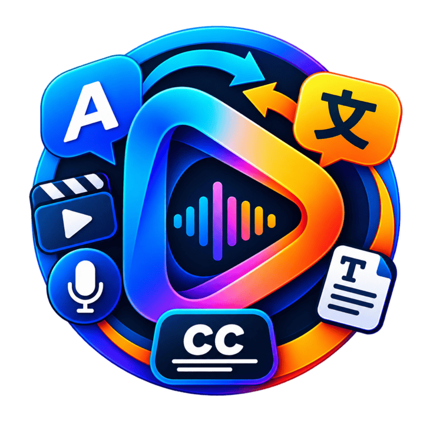
</p>

<h1 align="center">SubTranscribe Studio</h1>

<p align="center">
  <b>Local, private, AI-powered subtitle generator, translator &amp; audio intelligence studio</b><br>
  Turn any video or audio file into accurate subtitles — entirely on your own PC, no internet or cloud upload required.
</p>

<p align="center">
  <a href="https://github.com/mdakashhossain1/SubTranscribe-Studio/stargazers"></a>
  <a href="https://github.com/mdakashhossain1/SubTranscribe-Studio/releases/latest"></a>
  <a href="https://github.com/mdakashhossain1/SubTranscribe-Studio/blob/main/LICENSE"></a>
  <a href="https://github.com/mdakashhossain1/SubTranscribe-Studio/issues"></a>
  <a href="https://github.com/mdakashhossain1/SubTranscribe-Studio/network/members"></a>
</p>

<p align="center">
  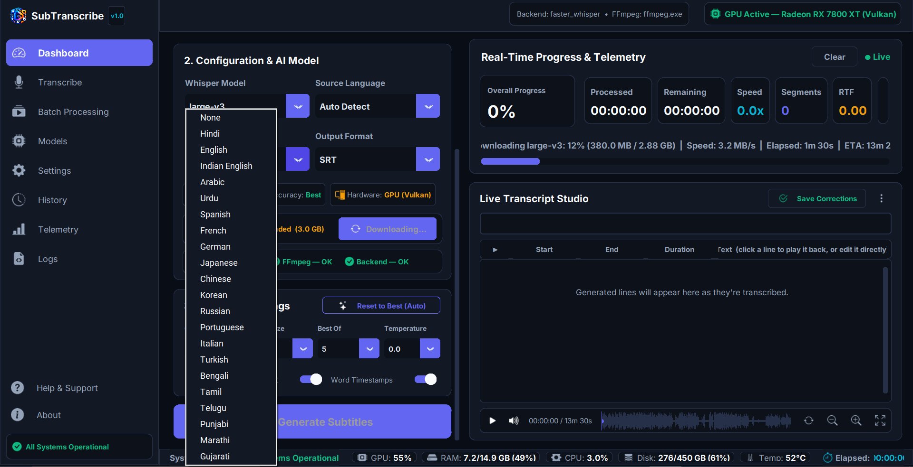
</p>

---

## Download & Deployment

Grab prebuilt applications for **Windows**, **Linux**, **macOS**, **Raspberry Pi**, and **Docker** from the **[Releases page](https://github.com/mdakashhossain1/SubTranscribe-Studio/releases/latest)** — no Python install required:

### 🪟 Windows (10/11)
- **`SubTranscribe_Studio_Setup_v1.0.0.exe`** — Installer (Start Menu shortcut & clean uninstaller)
- **`SubTranscribe-Studio-Windows-Portable.zip`** — Portable bundle (Unzip and run `SubGen.exe`)

### 🐧 Linux (Ubuntu / Debian / Fedora / Arch)
- **`SubTranscribe-Studio-Linux-x86_64.tar.gz`** — Linux standalone binary bundle (`./SubGen`)

### 🍓 Raspberry Pi OS (Raspberry Pi 4 / 5 - ARM64 Linux)
- **`SubTranscribe-Studio-RaspberryPi-arm64.tar.gz`** — ARM64 Linux standalone bundle (`./SubGen`)

### 🍎 macOS (MacBook / Mac Intel & Apple Silicon M1/M2/M3/M4)
- **`SubTranscribe-Studio-macOS-universal.zip`** — macOS desktop app bundle

### 🐳 Docker Container (Synology NAS / Unraid / TrueNAS / Linux Server)
Run locally in Docker with 1 command:
```bash
docker compose up -d
```
Or build custom Docker image:
```bash
docker build -t subtranscribe-studio .
```

> **First Run Notes:**
> - **Windows**: If SmartScreen flags the installer on first run, click **More info → Run anyway**.
> - **macOS**: On first launch, right-click `SubTranscribeStudio` and click **Open** to approve.

Every release is built automatically for Windows, Linux, macOS, Raspberry Pi, and Docker by [GitHub Actions](.github/workflows/build-desktop.yml).

## What is SubTranscribe Studio?

SubTranscribe Studio is a desktop application that listens to a video or audio file and writes out subtitles for it automatically, using OpenAI's Whisper speech-recognition AI running **locally on your computer**. Nothing you transcribe ever leaves your PC.

It can:

- Generate subtitles from almost any video or audio file (MP4, MKV, AVI, MOV, WEBM, MP3, WAV, FLAC, OGG, M4A, AAC)
- Export subtitles as **SRT**, **WebVTT**, **ASS (Advanced SubStation Alpha)**, or plain **TXT**
- Automatically translate the subtitles into 100+ languages
- Use your GPU (NVIDIA CUDA or AMD/Intel via Vulkan) for fast processing, or fall back to a quantized CPU mode if you don't have a supported GPU
- Process a single file or queue up a whole batch of files at once

## Getting Started

**Prebuilt (recommended):** download and run the installer or portable ZIP from the [Releases page](https://github.com/mdakashhossain1/SubTranscribe-Studio/releases/latest) — nothing else to set up.

**From source:**

1. Double-click **`run.bat`**.
   - The first time you run it, it will automatically create a local Python environment and install everything it needs — just wait for it to finish.
   - Every time after that, it launches instantly.
2. The app opens on the **Dashboard**. Pick a file, choose your settings, and click **Generate Subtitles**.

That's it — no accounts, no sign-in, no internet connection required for transcription.

---

## A Tour of the App

The app is organized into a sidebar of screens. Here's what each one does.

### 🎛️ Dashboard

The main workspace, and the screen you land on when you open the app. It's split into two halves:

- **Left side** — pick your input media file and output folder, choose your AI model, source language, translation target, and output format, and fine-tune advanced engine options (compute precision, beam size, etc.). A big **Generate Subtitles** button starts the job.
- **Right side** — live progress while a file is being processed (percentage complete, processing speed, segment count, real-time speed multiplier, GPU usage), plus a **Live Transcript Studio** with a real waveform player: play/pause, click-to-seek, zoom in/out, and lines that highlight in sync with playback so you can verify — and directly edit — anything transcribed incorrectly.

Use this screen for everyday, single-file transcription with full control over every setting.

<p align="center">
  
</p>
<p align="center">
  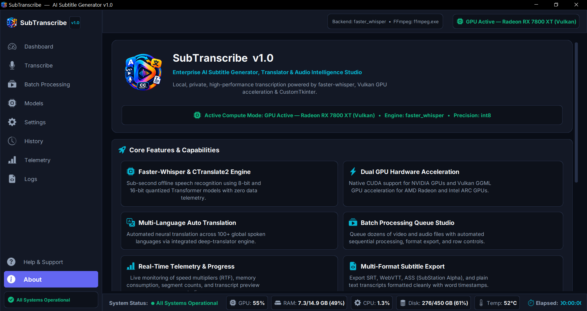
</p>

### 🎙️ Transcribe

A simplified, focused version of the Dashboard for when you just want to get subtitles quickly. Drop in a file, pick a model/language/format from a short list of dropdowns, and go — without the extra advanced controls cluttering the screen.

<p align="center">
  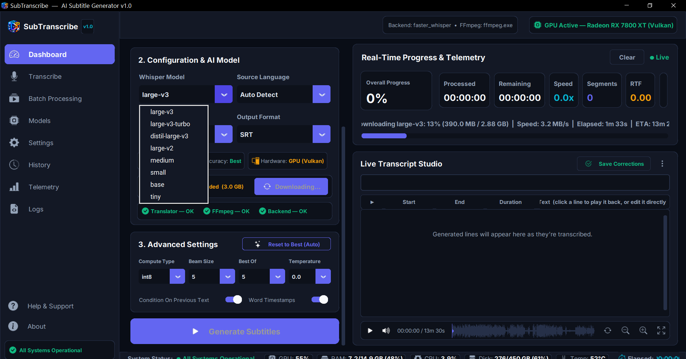
</p>

### 📼 Batch Processing

Queue up multiple video or audio files and transcribe them one after another automatically instead of doing them one at a time. Add files with **Add Media Files**, review the queue (file name, output format, status), remove anything you don't want, then click **Start Batch Processing** to run through the whole list.

<p align="center">
  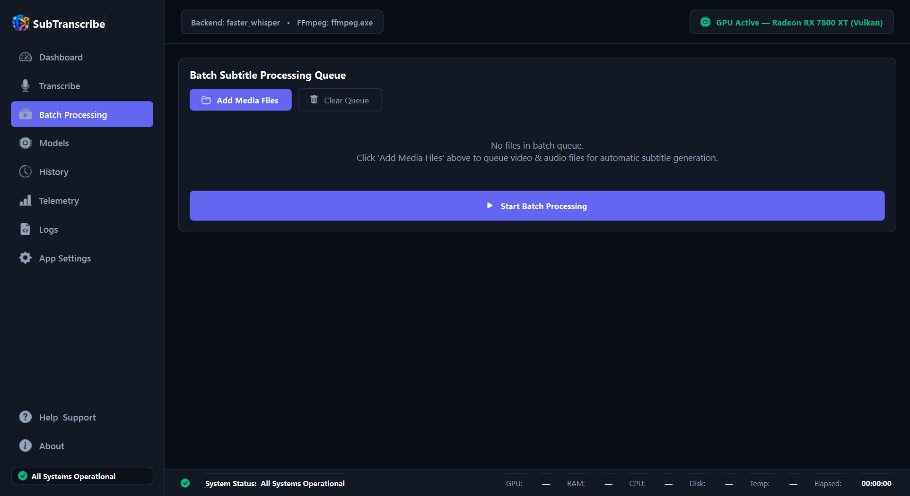
</p>

### 🧠 Models

The AI Model Manager. Whisper comes in several sizes, and this screen lets you download, switch, and delete them:

| Model | Size | Speed | Accuracy |
|---|---|---|---|
| `tiny` | 75 MB | Fastest | Lowest |
| `base` | 145 MB | Very Fast | Fair |
| `small` | 484 MB | Fast | Good |
| `medium` | 1.5 GB | Moderate | High |
| `distil-large-v3` | 756 MB | Very Fast | Very High |
| `large-v3-turbo` | 809 MB | Fast (8× large-v3) | Very High |
| `large-v2` | 3.1 GB | Slow | Very High |
| `large-v3` | 3.1 GB | Slow | **Best** |

Bigger models are more accurate but need more disk space, memory, and time. Each model card shows its download size, approximate memory requirement, and whether it's already downloaded on your PC. Not sure which to pick? The **Reset to Best (Auto)** button on the Dashboard's Advanced Settings will detect your GPU/CPU and pick the strongest model your hardware can comfortably run.

<p align="center">
  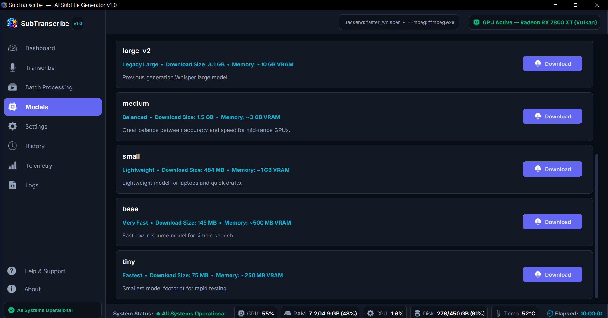
</p>

### ⚙️ Settings

Application-wide preferences that apply no matter which file you're working on:

- Default subtitle output format and default source language
- Status of your FFmpeg installation (used to read audio/video files) and your GPU compute backend
- **Create Desktop Shortcut** — adds a shortcut to your Windows Desktop with the app's icon
- **Purge All Models & Cache** — a full cleanup button that deletes every downloaded AI model, cached file, and history entry, leaving no trace on your PC

<p align="center">
  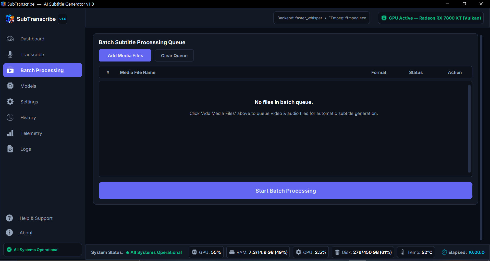
</p>

### 🕘 History

A running log of every subtitle file you've generated: which media file it came from, which model and format were used, and when. From here you can reopen the finished subtitle file, jump straight to the folder it was saved in, remove a single entry, or clear the whole history.

<p align="center">
  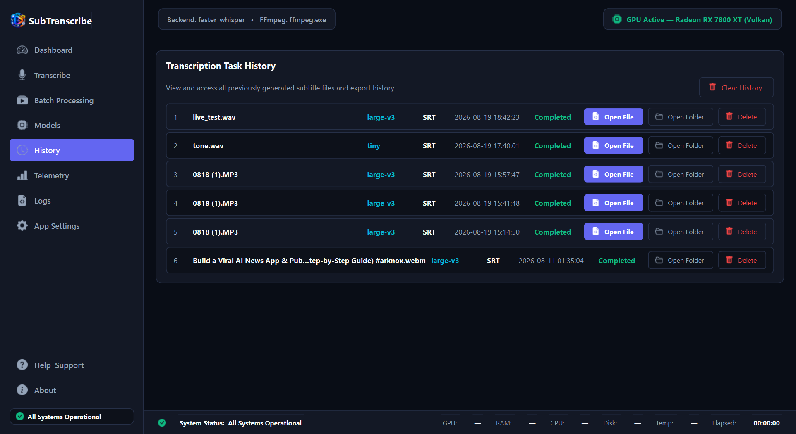
</p>

### 📊 Telemetry

A live hardware readout — your detected GPU, which compute engine is active (CUDA / Vulkan / CPU), your FFmpeg status, and how much disk space your downloaded AI models are using. Handy for confirming the app is actually using your GPU, and for troubleshooting performance.

<p align="center">
  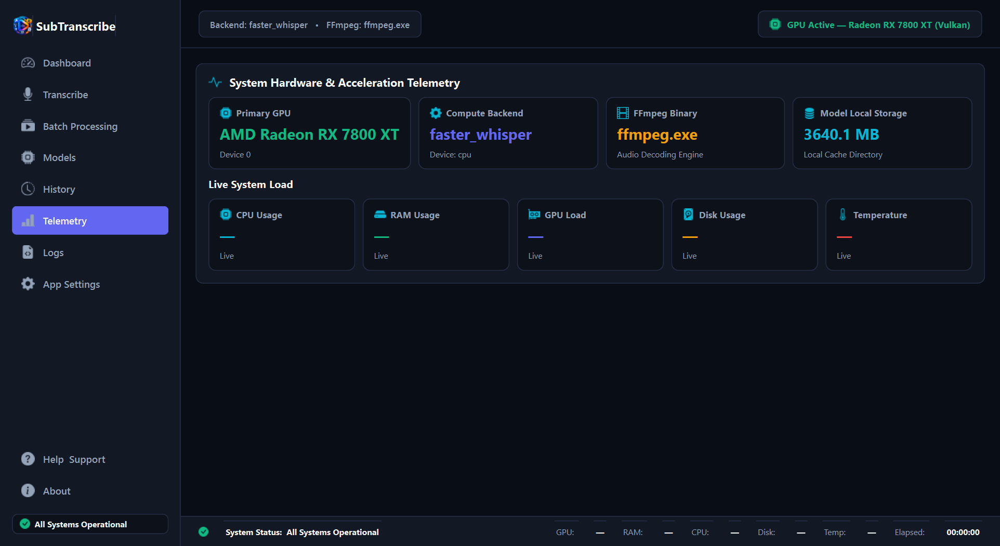
</p>

### 📄 Logs

A plain technical event log of what the application has been doing internally (startup checks, detected hardware, backend/device info). You can copy the log to your clipboard or clear it — useful if you ever need to share diagnostic details when reporting a problem.

<p align="center">
  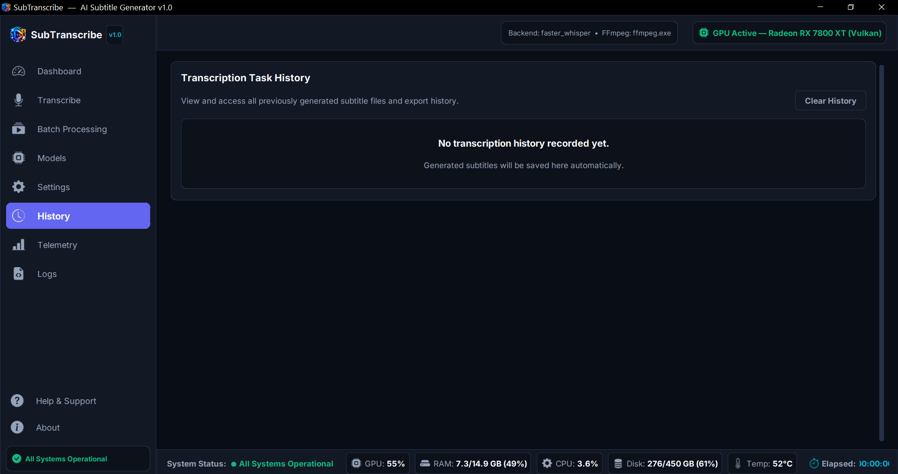
</p>

### ❓ Help & Support

A quick built-in user guide covering how to generate subtitles, how GPU acceleration works (NVIDIA vs AMD/Intel vs CPU-only), and the list of supported input and output formats.

<p align="center">
  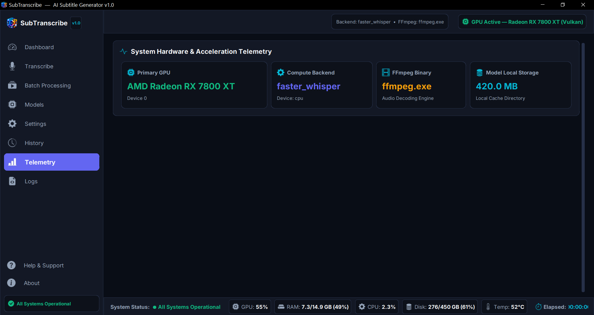
</p>

### ℹ️ About

Information about the app itself: version number, active compute mode, the core features list, and the underlying technology it's built on (Python, CustomTkinter, faster-whisper/CTranslate2, whisper.cpp, FFmpeg, Bootstrap Icons).

<p align="center">
  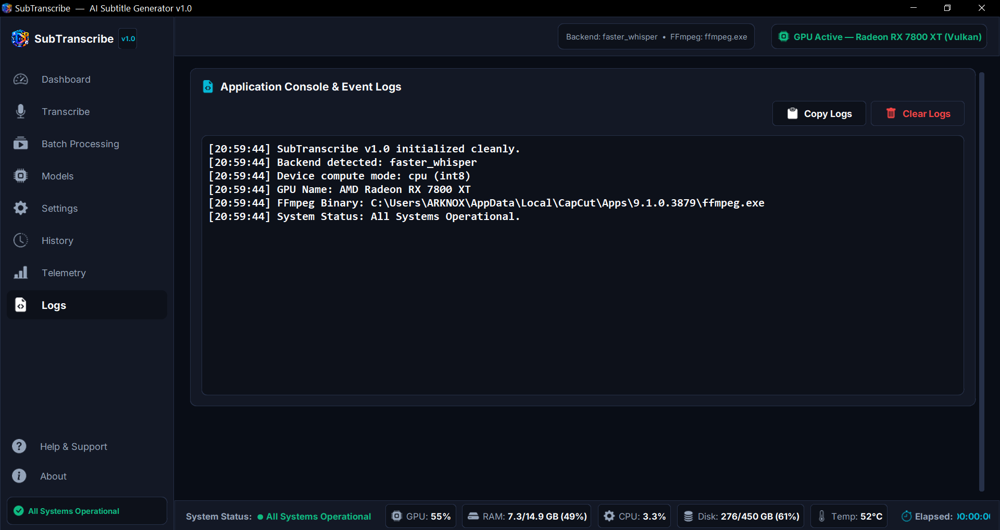
</p>

---

## Supported Formats

- **Video in:** MP4, MKV, AVI, MOV, WEBM
- **Audio in:** MP3, WAV, FLAC, OGG, M4A, AAC
- **Subtitles out:** SRT, WebVTT, ASS (Advanced SubStation Alpha), TXT

## Requirements

- Windows 10/11
- Python 3.10+ (only needed the first time — `run.bat` sets everything else up for you)
- An NVIDIA, AMD, or Intel GPU is recommended for speed, but not required — the app runs fine on CPU only

## Privacy

All transcription and translation happens locally on your machine using downloaded AI models. Your media files, transcripts, and subtitles are never uploaded anywhere.

---

## 🤝 Contributing

Contributions make the open-source community an amazing place to learn, inspire, and create! Any contributions you make are **greatly appreciated**.

Please see our **[CONTRIBUTING.md](CONTRIBUTING.md)** for details on how to set up your local development environment, propose features, and submit Pull Requests.

Please review our **[Code of Conduct](CODE_OF_CONDUCT.md)** before participating.

---

## 🔒 Security

For security vulnerabilities and disclosure instructions, please see our **[SECURITY.md](SECURITY.md)** policy.

---

## 📄 License

Distributed under the **MIT License**. See **[LICENSE](LICENSE)** for more information.

---

## ⭐ Support & Star History

If you find **SubTranscribe Studio** useful, please consider giving it a ⭐ **Star** on GitHub — it helps the project grow and reach more users!

[](https://star-history.com/#mdakashhossain1/SubTranscribe-Studio&Date)

